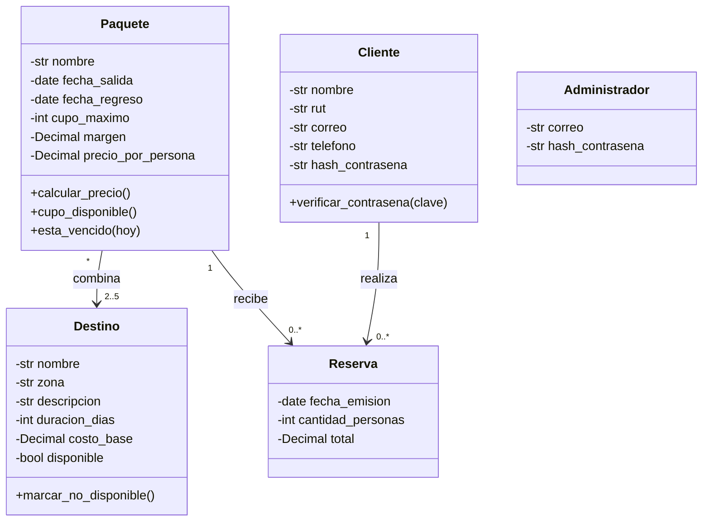

# Informe de Proyecto — Sistema de Gestión Viajes Aventura

**Ramo:** TI3V21 · Programación Orientada a Objeto Seguro · Unidad 4
**Institución:** INACAP Valparaíso
**Estado del documento:** Borrador v0.1 (pendiente de ajustar según la rúbrica de evaluación)

---

## 1. Introducción

Este informe describe el análisis, el diseño y el estado de avance del sistema para **Viajes Aventura**, una agencia de Valparaíso que arma y vende paquetes turísticos combinando destinos propios. Hoy la agencia opera con una planilla compartida, un cuaderno de reservas y conversaciones de mensajería, lo que ha provocado errores de negocio y riesgos para los datos de sus clientes.

**Objetivo general:** construir la primera versión de un sistema que reemplace la planilla y el cuaderno, garantizando integridad de los datos del negocio y protección de las credenciales y datos sensibles de los clientes.

**Objetivos específicos**

1. Traducir las reglas de negocio confirmadas (R1–R17) en requerimientos del sistema.
2. Declarar y fundamentar los supuestos necesarios donde el caso no entrega información.
3. Diseñar un modelo orientado a objetos que haga cumplir las reglas por construcción.
4. Incorporar seguridad desde el diseño (autenticación, validación de entradas, protección de datos sensibles).
5. Definir una estrategia de pruebas que verifique los problemas detectados en la temporada.

---

## 2. Análisis del problema

La temporada cerró con 214 reservas y cifras que evidencian fallas del proceso manual. Cada una se relaciona con una causa distinta y, por lo tanto, con una solución distinta en el sistema.

| Problema detectado | Cifra | Causa raíz | Cómo lo resuelve el sistema |
|---|---|---|---|
| Reservas duplicadas | 19 | Dos socios anotan la misma reserva; clientes sin identidad única | Cliente con correo único (R9) y una sola fuente de datos |
| Reservas sobre el cupo | 6 | El cupo se lleva "en la cabeza y en el cuaderno" | El sistema mantiene el cupo y calcula el disponible (R14) |
| Reservas sobre paquetes vencidos | 3 | Nadie retira los paquetes cuya fecha pasó | Se compara la fecha de salida con la fecha del día al reservar (R15) |
| Precio publicado distinto del cobrado | 4 | Cambia el costo de un destino después de vender el paquete | El precio queda fijado al publicar (R7) y el total al reservar (R13) |
| Consultas resueltas revisando el cuaderno | 31 | Sin historial centralizado | Historial de reservas por cliente autenticado (R11) |
| Destinos no operados aún visibles | 4 | No se pueden borrar porque forman parte de paquetes vendidos | Estado "no disponible" en lugar de eliminación (R8) |

Los problemas de **cupo** y de **fecha vencida** no son equivalentes: el primero exige comparar contra un dato que el sistema debe llevar (personas ya reservadas) y el segundo, contra la fecha del día. Los problemas de **precio** no son errores de suma, sino consecuencia de que el costo de un destino cambie después de vendido un paquete.

Además, existe un riesgo de seguridad señalado por el socio de administración: el RUT y el teléfono están en una planilla que se abre desde computadores personales y se ha enviado por correo.

---

## 3. Alcance de la primera versión

**Dentro del alcance**

- **Destinos:** registrar, modificar, dejar no disponible y listar los del catálogo.
- **Paquetes:** crear combinando destinos, definir fechas y cupo, calcular el precio y consultar disponibilidad.
- **Reservas:** registro y autenticación de clientes, reservar un paquete, almacenar la reserva y consultar el historial propio.
- **Seguridad del sistema:** autenticación, validación de todo dato ingresado y protección de credenciales y datos sensibles.

**Fuera del alcance:** pasarela de pago y verificación automática de transferencias, facturación electrónica, aplicación móvil, integraciones con aerolíneas/hoteles/operadores, envío de correos o mensajería, informes de gestión y contabilidad.

---

## 4. Requerimientos

Las reglas de negocio describen cómo funciona la agencia; los requerimientos describen qué debe hacer el sistema. La columna *Origen* deja la trazabilidad con las reglas del caso.

### 4.1 Requerimientos funcionales

| ID | Requerimiento | Origen |
|---|---|---|
| RF-01 | El sistema debe permitir al administrador registrar un destino con nombre, zona, descripción, duración en días y costo base por persona, rechazando nombres repetidos y costos menores o iguales a cero. | R1, R2 |
| RF-02 | El sistema debe permitir al administrador modificar los datos de un destino. | Alcance |
| RF-03 | El sistema debe listar los destinos del catálogo, distinguiendo los disponibles de los no disponibles. | Alcance, R8 |
| RF-04 | Al retirar un destino, el sistema debe eliminarlo si no forma parte de ningún paquete y marcarlo como no disponible si forma parte de alguno. | R8 |
| RF-05 | El sistema debe permitir crear un paquete con nombre, fecha de salida, fecha de regreso, cupo máximo y entre 2 y 5 destinos disponibles sin repeticiones. | R3, R4, R5 |
| RF-06 | El sistema debe calcular el precio por persona de un paquete como la suma de los costos base de sus destinos más el margen de operación definido por el administrador (no negativo). | R6 |
| RF-07 | El sistema debe fijar el precio del paquete al publicarlo y conservarlo aunque cambie después el costo de un destino. | R7 |
| RF-08 | El sistema debe permitir consultar el cupo disponible de un paquete (cupo máximo menos personas ya reservadas). | R14 |
| RF-09 | El sistema debe permitir registrar un cliente con nombre, RUT, correo, teléfono y contraseña, con correo único. | R9 |
| RF-10 | El sistema debe autenticar al cliente antes de permitirle reservar o consultar reservas. | R11 |
| RF-11 | El sistema debe permitir a un cliente autenticado reservar un paquete indicando la cantidad de personas, registrando fecha de emisión y total cobrado. | R12 |
| RF-12 | El sistema debe calcular el total de la reserva (precio del paquete × personas) al momento de reservar y no modificarlo después. | R13 |
| RF-13 | El sistema debe rechazar reservas que superen el cupo disponible, con fecha de salida vencida o con menos de una persona. | R14, R15, R16 |
| RF-14 | El sistema debe permitir a cada cliente consultar únicamente su propio historial de reservas. | R11 |

### 4.2 Requerimientos no funcionales (seguridad y calidad)

| ID | Requerimiento | Origen |
|---|---|---|
| RNF-01 | Las contraseñas deben almacenarse solo como hash con sal, nunca en texto plano. | R10 |
| RNF-02 | Todo dato ingresado debe validarse (tipo, formato, rango y longitud) antes de procesarse. | Alcance |
| RNF-03 | RUT y teléfono no deben aparecer en listados ni en mensajes de error. | R17 |
| RNF-04 | Un cliente no debe poder acceder a reservas de otro cliente. | R11 |
| RNF-05 | Las operaciones de administración de catálogo y paquetes deben requerir rol de administrador. | Supuesto S3 |
| RNF-06 | Los mensajes de error deben ser informativos para el usuario sin revelar detalles internos ni datos sensibles. | R17 |
| RNF-07 | Las reglas de negocio deben residir en el modelo/servicios y no en la interfaz, de modo que no puedan omitirse. | Diseño |

---

## 5. Supuestos y vacíos del caso

El caso indica que detectar lo que falta es criterio profesional, y que cada supuesto debe declararse y fundamentarse técnicamente. Los siguientes quedan **pendientes de confirmar** con el docente o la rúbrica.

| ID | Vacío detectado | Supuesto adoptado | Fundamento |
|---|---|---|---|
| S1 | ¿Qué ocurre si un cliente desiste de una reserva? | En la v1 no existe cancelación: la reserva es inmutable. El diseño deja espacio para agregar un estado "cancelada" que libere cupo. | No está en el alcance acordado y R13 establece que el total no vuelve a cambiar. |
| S2 | ¿Cómo se comporta un paquete cuando termina su temporada? | Un paquete con fecha de salida anterior a hoy queda "vencido" (condición calculada, no almacenada): no admite reservas pero se conserva en el historial. | Evita el problema de los 3 paquetes vencidos vendidos y mantiene el contenido de reservas pasadas (coherente con R8). |
| S3 | ¿Quién puede modificar el catálogo? | Solo un usuario con rol administrador autenticado. Los clientes solo consultan. El administrador no se autorregistra: se crea por configuración. | Principio de mínimo privilegio; evita que un cliente altere costos o cupos. |
| S4 | El margen "habitualmente 20 %": ¿es porcentaje o monto? | Se trata como porcentaje sobre la suma de costos, con valor por defecto 20 % y mínimo 0 %. Precio = suma de costos × (1 + margen). | El texto lo expresa como porcentaje y "nunca es negativo". |
| S5 | ¿Cuándo se "publica" un paquete? | En la v1, crear un paquete equivale a publicarlo: el precio se calcula y se fija en ese momento. | Simplifica el flujo sin contradecir R7. |
| S6 | ¿Puede un cliente reservar dos veces el mismo paquete? | Se rechaza una segunda reserva del mismo cliente sobre el mismo paquete. | Previene duplicados (19 en la temporada) causados por doble registro. |
| S7 | Formato de datos personales. | El RUT se valida con su dígito verificador; el correo, con formato válido; el teléfono, con formato numérico chileno. | Impide datos basura, que en la planilla producían registros inconsistentes. |
| S8 | Política de contraseñas. | Mínimo 8 caracteres; almacenamiento con algoritmo de hash con sal (por ejemplo PBKDF2, bcrypt o Argon2). | Cumple R10 con prácticas estándar de la industria. |
| S9 | Unicidad del nombre de destino. | Se compara normalizando mayúsculas, espacios y tildes. | En la planilla había "destinos repetidos con nombres distintos". |
| S10 | Fecha de salida igual a hoy. | Se acepta reservar hasta el mismo día de la salida; se rechaza si la salida es anterior a hoy. | R15 dice "ya pasó", lo que implica fecha estrictamente anterior. |
| S11 | Persistencia de los datos. | Por definir (archivo local o base de datos ligera). El diseño separa el acceso a datos mediante repositorios para no depender de la elección. | Permite cambiar el medio de almacenamiento sin tocar las reglas de negocio. |

---

## 6. Diseño propuesto

### 6.1 Modelo de clases



**Decisiones de diseño**

- **Paquete conserva su precio (R7):** el precio por persona se calcula una sola vez al crear el paquete y se guarda; no se recalcula desde los destinos.
- **Destino no se elimina si está en un paquete (R8):** el servicio de catálogo consulta las composiciones antes de decidir entre eliminar o marcar no disponible.
- **Reserva inmutable (R13):** el total se calcula en el constructor y la clase no ofrece métodos que lo modifiquen.
- **Encapsulamiento:** los atributos son privados y solo se modifican mediante métodos que validan las invariantes (costo > 0, cupo > 0, personas ≥ 1, regreso posterior a salida).
- **Datos sensibles (R17):** `Cliente` no expone RUT ni teléfono en su representación de texto; solo se ofrecen versiones enmascaradas cuando es estrictamente necesario.

### 6.2 Capas y responsabilidades

| Capa | Responsabilidad |
|---|---|
| Modelo | Entidades con sus invariantes (Destino, Paquete, Cliente, Reserva, Administrador). |
| Servicios | Reglas que involucran varias entidades: catálogo, armado de paquetes, reservas y autenticación. |
| Repositorios | Acceso a los datos, aislado del resto del sistema. |
| Seguridad | Hash de contraseñas, validadores (RUT, correo, teléfono), enmascarado de datos sensibles. |
| Interfaz | Entrada/salida; no contiene reglas de negocio. |

### 6.3 Estructura de carpetas propuesta

```
viajes_aventura/
├── modelo/
│   ├── destino.py
│   ├── paquete.py
│   ├── cliente.py
│   ├── reserva.py
│   └── administrador.py
├── servicios/
│   ├── catalogo_servicio.py
│   ├── paquete_servicio.py
│   ├── reserva_servicio.py
│   └── autenticacion_servicio.py
├── repositorios/
│   ├── destino_repositorio.py
│   ├── paquete_repositorio.py
│   ├── cliente_repositorio.py
│   └── reserva_repositorio.py
├── seguridad/
│   ├── contrasenas.py
│   ├── validadores.py
│   └── enmascarado.py
├── excepciones.py
├── main.py
└── tests/
```

> Lenguaje de implementación: por confirmar (se propone Python).

---

## 7. Seguridad

| Amenaza / riesgo | Control previsto | Requerimiento |
|---|---|---|
| Robo o filtración de contraseñas | Hash con sal; nunca se guarda ni se registra la contraseña original | RNF-01 |
| Datos inválidos o maliciosos | Validación de tipo, formato, rango y longitud en cada entrada | RNF-02 |
| Exposición de RUT y teléfono | Se excluyen de listados y mensajes de error; enmascarado cuando se requiera mostrarlos | RNF-03, RNF-06 |
| Acceso a reservas ajenas | Toda consulta de reservas se filtra por el cliente autenticado | RNF-04 |
| Modificación no autorizada del catálogo | Verificación de rol administrador en cada operación | RNF-05 |
| Alteración de precios o totales ya cobrados | Precio y total inmutables una vez fijados | RF-07, RF-12 |

---

## 8. Estado de implementación

> A la fecha de este borrador el trabajo realizado corresponde al **análisis y diseño**. El estado de cada módulo debe actualizarse con el avance real del código.

| Componente | Estado | Observaciones |
|---|---|---|
| Análisis del caso y transcripción del enunciado | Completado | `caso_viajes_aventura.md` |
| Requerimientos y supuestos | Borrador | Falta confirmar supuestos con el docente/rúbrica |
| Modelo de clases | Borrador | Diagrama en sección 6.1 |
| Modelo: Destino | Pendiente | |
| Modelo: Paquete | Pendiente | |
| Modelo: Cliente | Pendiente | |
| Modelo: Reserva | Pendiente | |
| Servicios (catálogo, paquetes, reservas, autenticación) | Pendiente | |
| Seguridad (hash, validadores, enmascarado) | Pendiente | |
| Persistencia | Pendiente | Medio por definir (S11) |
| Interfaz | Pendiente | |
| Pruebas | Pendiente | Ver sección 9 |

---

## 9. Estrategia de pruebas

Los casos de prueba se construyen directamente desde los problemas de la temporada, de modo que cada falla del proceso manual quede cubierta por una prueba automatizada.

| Caso de prueba | Resultado esperado | Regla |
|---|---|---|
| Registrar dos destinos con el mismo nombre (incluso variando mayúsculas o tildes) | Se rechaza el segundo | R1 |
| Registrar un destino con costo 0 o negativo | Se rechaza | R2 |
| Crear paquete con 1 destino, con 6 destinos o con un destino repetido | Se rechaza | R3 |
| Crear paquete con fecha de regreso anterior a la de salida, o cupo 0 | Se rechaza | R5 |
| Crear paquete con margen negativo | Se rechaza | R6 |
| Calcular precio con destinos de costo 120.000 y 310.000 y margen 20 % | 516.000 por persona | R6 |
| Cambiar el costo de un destino tras publicar un paquete | El precio del paquete no cambia | R7 |
| Retirar un destino que pertenece a un paquete | Queda no disponible, no se elimina | R8 |
| Retirar un destino sin paquetes | Se elimina | R8 |
| Registrar dos clientes con el mismo correo | Se rechaza el segundo | R9 |
| Verificar el contenido almacenado de la contraseña | Es un hash, distinto del texto ingresado | R10 |
| Reservar sin autenticarse | Se rechaza | R11 |
| Consultar reservas de otro cliente | No se devuelve ninguna | R11 |
| Reservar 14 lugares en un paquete de cupo 12 | Se rechaza | R14 |
| Reservar dos veces hasta completar el cupo y una vez más | La última se rechaza | R14 |
| Reservar un paquete con fecha de salida pasada | Se rechaza | R15 |
| Reservar con 0 personas | Se rechaza | R16 |
| Provocar un error con datos de un cliente | El mensaje no contiene RUT ni teléfono | R17 |
| Reservar y luego cambiar costos | El total de la reserva no cambia | R13 |

> El precio del ejemplo (516.000) se obtiene de: (120.000 + 310.000) × 1,20.

---

## 10. Pendientes y ajustes

- [ ] Recibir la rúbrica y alinear estructura, títulos y profundidad del informe con sus criterios.
- [ ] Confirmar los supuestos S1–S11 con el docente.
- [ ] Definir lenguaje, persistencia e interfaz.
- [ ] Actualizar la sección 8 con el avance real del código.
- [ ] Agregar evidencias (capturas, resultados de pruebas) una vez implementado.
- [ ] Definir el formato final de entrega (por ejemplo Word o PDF).
